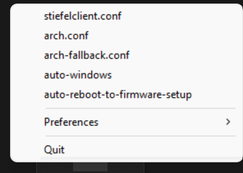

## What is this?

A small program that allows you to set the OS that will be booted on the next (re-)boot.
You need to have systemd-boot set up as your boot loader.

## Why

On Linux with systemd, you can already do all of this via `bootctl set-oneshot` or `systemctl reboot --boot-loader-entry=`.
However, on windows or non-systemd linux distributions this is not possible out of the box.
This program is here to help.

## Building

### Windows

Requirements:

* mingw-64

### Linux

For tray program:

* gcc
* pkg-config
* libappindicator

## Usage

Run either `systemd-reboot-console(.exe)` or `systemd-reboot-tray(.exe)` depending whether you want to run the interactive console version or having a persistent system tray menu.
Note that on windows you will need to run the programs as administrator and on linux with root permissions (i.e. sudo).

## How to Auto-Start on Windows

1. Start `Task Scheduler`
2. Go to `Action->Create Task`
3. Give it a name and check `Run with highest priviliges`
4. Go to `Actions->New` and `Browse` select `systemd-reboot-tray.exe` and press `Ok`
5. Go to `Triggers->New` and choose `At log in` and press `Ok`
6. Finally press `Ok` to create the task

## Screenshots

Tray icon in Windows 11:

Tray menu in Windows 11:

### Icon

The reboot icon is taken from [Reshot](https://www.reshot.com/free-svg-icons/item/repeat-circle-HV9A4UQC5E/) under the [Reshot License](https://www.reshot.com/license/).
